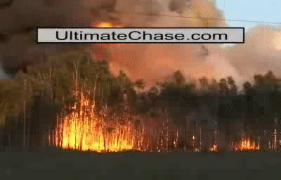

# Flame_Smoke_Detection

- This is the project for IMP301(assignment 1).
- The implementation is simplely based on the details paper on reference.

## Docs

- [Summary detail](docs/summary.pdf)

## Demo

 
 

 
 

 

## References

- [A real-time video fire flame and smoke detection algorithm - Chunyu Yu*, Zhibin Mei, Xi Zhang](https://www.sciencedirect.com/science/article/pii/S1877705813013222)
- [Real Time Video Based-Early Fire Smoke Detection for Outdoor Environment - Pham N. Giao 1 , Vuong P. Thanh 2 , Ngo T. Son 3 , Nguyen H. Phong 4 , Pham N. Khoa 5 , and Ki-Ryong
Kwon 6](https://www.fpt-software.com/wp-content/uploads/sites/2/2018/03/Real-Time-Video-Based-Early-Fire-Smoke-Detection-for-Outdoor-Environment.pdf)
